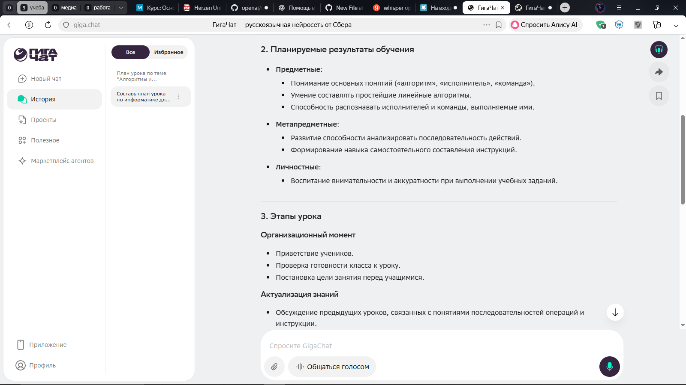
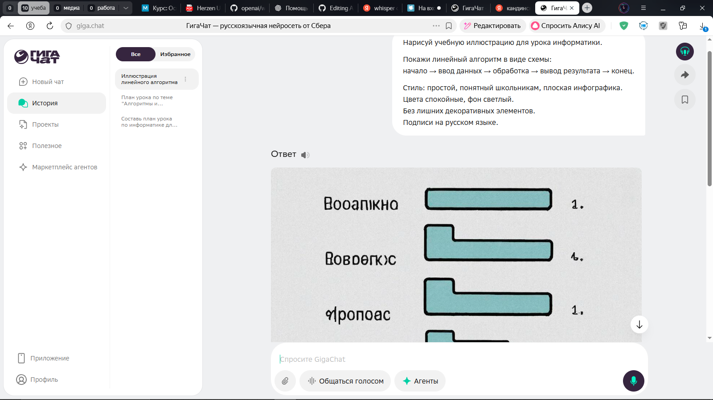
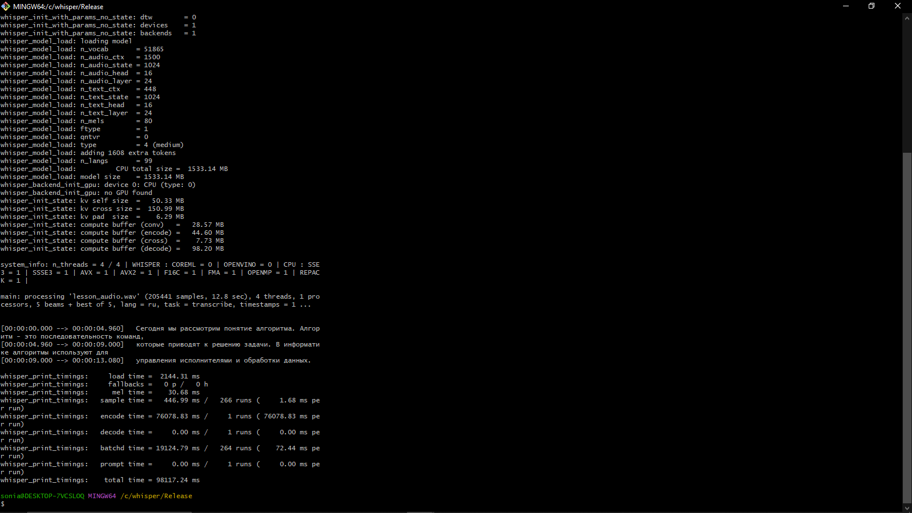

# Лабораторная работа № 1

**«Подбор инструментов искусственного интеллекта для типовых задач педагога»**

**Выполнила:** Чудная Софья, группа 2об_ПОО/24 

---

## Задание 1. Анализ типовых задач педагога

### 1.1. Перечень типовых задач

| №  | Задача                                          | Категория             | Частота     | Трудоёмкость (1–5) |
| -- | ----------------------------------------------- | --------------------- | ----------- | ------------------ |
| 1  | Составление плана урока                         | планирование          | ежедневно   | 3                  |
| 2  | Подготовка конспекта урока                      | создание контента     | ежедневно   | 3                  |
| 3  | Создание тестовых заданий                       | контроль и оценивание | еженедельно | 4                  |
| 4  | Проверка письменных работ учащихся              | контроль и оценивание | ежедневно   | 5                  |
| 5  | Подготовка презентаций к урокам                 | визуализация          | еженедельно | 4                  |
| 6  | Подбор учебных материалов и источников          | создание контента     | еженедельно | 3                  |
| 7  | Адаптация учебных материалов под уровень класса | создание контента     | еженедельно | 4                  |
| 8  | Подготовка домашних заданий                     | планирование          | еженедельно | 3                  |
| 9  | Формирование обратной связи учащимся            | коммуникация          | ежедневно   | 4                  |
| 10 | Общение с родителями                            | коммуникация          | еженедельно | 3                  |
| 11 | Ведение электронного журнала                    | документооборот       | ежедневно   | 3                  |
| 12 | Подготовка отчётной документации                | документооборот       | ежемесячно  | 4                  |
| 13 | Анализ результатов контрольных работ            | контроль и оценивание | еженедельно | 4                  |
| 14 | Создание наглядных схем и таблиц                | визуализация          | еженедельно | 3                  |
| 15 | Планирование учебной нагрузки                   | административные      | ежемесячно  | 3                  |

### 1.2. Приоритизация задач

| № приоритета | Задача                                          | Потенциал автоматизации (%) |
| ------------ | ----------------------------------------------- | --------------------------- |
| 1            | Проверка письменных работ учащихся              | 70                          |
| 2            | Создание тестовых заданий                       | 80                          |
| 3            | Адаптация учебных материалов под уровень класса | 75                          |
| 4            | Анализ результатов контрольных работ            | 65                          |
| 5            | Подготовка презентаций к урокам                 | 60                          |

---

## Задание 2. Подбор инструментов

### 2.1. Матрица инструментов

#### Задача 1. Проверка письменных работ учащихся

* **Отечественный:** GigaChat — [https://giga.chat](https://giga.chat)
  *Плюсы:* качественный русский язык, педагогический контекст
  *Минусы:* требуется интернет
* **Зарубежный бесплатный:** DeepSeek — [https://chat.deepseek.com](https://chat.deepseek.com)
  *Плюсы:* сильный анализ текстов
  *Минусы:* зарубежная обработка данных
* **Open-Source:** Ollama + LLM — [https://ollama.com](https://ollama.com)
  *Плюсы:* локальная работа, конфиденциальность
  *Минусы:* требует настройки

#### Задача 2. Создание тестовых заданий

* **Отечественный:** YandexGPT — [https://ya.ru/chat](https://ya.ru/chat)
  *Плюсы:* корректные формулировки на русском языке
  *Минусы:* нет встроенного конструктора тестов
* **Зарубежный бесплатный:** Qwen — [https://qwen.ai](https://qwen.ai)
  *Плюсы:* бесплатный доступ, длинный контекст
  *Минусы:* не ориентирован на ФГОС
* **Open-Source:** LocalAI — [https://github.com/mudler/LocalAI](https://github.com/mudler/LocalAI)
  *Плюсы:* OpenAI-совместимый API
  *Минусы:* требуется Docker

#### Задача 3. Адаптация учебных материалов

* **Отечественный:** GigaChat
* **Зарубежный бесплатный:** Qwen
* **Open-Source:** LM Studio — [https://lmstudio.ai](https://lmstudio.ai)

#### Задача 4. Анализ результатов контрольных работ

* **Отечественный:** YandexGPT
* **Зарубежный бесплатный:** DeepSeek
* **Open-Source:** GPT4All — [https://github.com/nomic-ai/gpt4all](https://github.com/nomic-ai/gpt4all)

#### Задача 5. Подготовка презентаций

* **Отечественный:** GigaChat + Kandinsky
* **Зарубежный бесплатный:** Gamma.app — [https://gamma.app](https://gamma.app)
* **Open-Source:** Stable Diffusion WebUI — [https://github.com/AUTOMATIC1111/stable-diffusion-webui](https://github.com/AUTOMATIC1111/stable-diffusion-webui)

### 2.2. Тестирование инструментов

#### Инструмент 1: GigaChat

| Параметр                 | Оценка  | Комментарий                |
| ------------------------ | ------- | -------------------------- |
| Регистрация и доступ     | 5       | Доступен в РФ              |
| Интерфейс                | 5       | Интуитивный                |
| Качество результата      | 4       | Требует минимальной правки |
| Скорость работы          | 5       | Высокая                    |
| Поддержка русского языка | 5       | Высокая                    |
| **Итоговая оценка**      | **4.8** |                            |

#### Инструмент 2: Kandinsky

| Параметр                 | Оценка  | Комментарий         |
| ------------------------ | ------- | ------------------- |
| Регистрация и доступ     | 4       | Аккаунт Сбера       |
| Интерфейс                | 4       | Понятный            |
| Качество результата      | 1       | Абсолютно не подходит для уроков |
| Скорость работы          | 3       | Средняя             |
| Поддержка русского языка | 5       | Отличная            |
| **Итоговая оценка**      | **3.4** |                     |

#### Инструмент 3: Whisper (локально)

| Параметр                 | Оценка  | Комментарий      |
| ------------------------ | ------- | ---------------- |
| Регистрация и доступ     | 5       | Не требуется     |
| Интерфейс                | 3       | CLI              |
| Качество результата      | 5       | Высокая точность |
| Скорость работы          | 4       | Зависит от ПК    |
| Поддержка русского языка | 5       | Корректная       |
| **Итоговая оценка**      | **4.4** |                  |

---

## Задание 3. Дополнительные возможности автоматизации

### 3.1. Неочевидные задачи

| № | Задача                     | Почему упускают       | Инструмент |
| - | -------------------------- | --------------------- | ---------- |
| 1 | Генерация идей проектов    | Считается творческой  | GigaChat   |
| 2 | Адаптация текстов          | Трудоёмко вручную     | Qwen       |
| 3 | Субтитры к видео           | Техническая сложность | Whisper    |
| 4 | Индивидуальные комментарии | Персонализация        | YandexGPT  |
| 5 | Глоссарии                  | Нет системности       | DeepSeek   |
| 6 | Материалы для ОВЗ          | Требует опыта         | GigaChat   |
| 7 | Анализ типичных ошибок     | Делается интуитивно   | GPT4All    |
| 8 | Вопросы для рефлексии      | Второстепенно         | GigaChat   |

### 3.2. Ручная цепочка инструментов

**Цепочка: создание адаптивных учебных материалов**

1. Подготовка исходного текста (вручную)
2. Адаптация под уровни — GigaChat / Qwen
3. Пояснение терминов — DeepSeek
4. Создание схем — GigaChat (Mermaid)
5. Финальная проверка — преподаватель

---

## Задание 4. Сравнительный анализ

### 4.1. Сравнение языковых моделей

| Критерий                | GigaChat  | YandexGPT    | DeepSeek  | Qwen      |
| ----------------------- | --------- | ------------ | --------- | --------- |
| Качество русского языка | высокое   | высокое      | среднее   | высокое   |
| Скорость                | высокая   | высокая      | высокая   | средняя   |
| Контекстное окно        | большое   | большое      | большое   | большое   |
| Работа с кодом          | средняя   | средняя      | высокая   | средняя   |
| Мультимодальность       | да        | да           | нет       | да        |
| Доступность в РФ        | полная    | полная       | полная    | полная    |
| Стоимость               | бесплатно | бесплатно    | бесплатно | бесплатно |
| API                     | да        | да           | да        | да        |
| Рекомендация            | основной  | альтернатива | анализ    | адаптация |

### 4.2. Выводы

1. Отечественные модели наиболее адаптированы для педагогической деятельности.
2. Зарубежные бесплатные инструменты целесообразно использовать для анализа.
3. GigaChat является универсальным инструментом для учителя.
4. Комбинация ИИ-инструментов повышает эффективность работы педагога.
5. Приоритет следует отдавать безопасности данных и доступности в РФ.

---

## Итоговый набор инструментов

Для повседневной педагогической деятельности рекомендуется использовать:

* **GigaChat** — основной ИИ-ассистент
* **YandexGPT** — генерация заданий и анализ
* **Kandinsky** — визуализация
* **Whisper (локально)** — работа с видео и аудио
